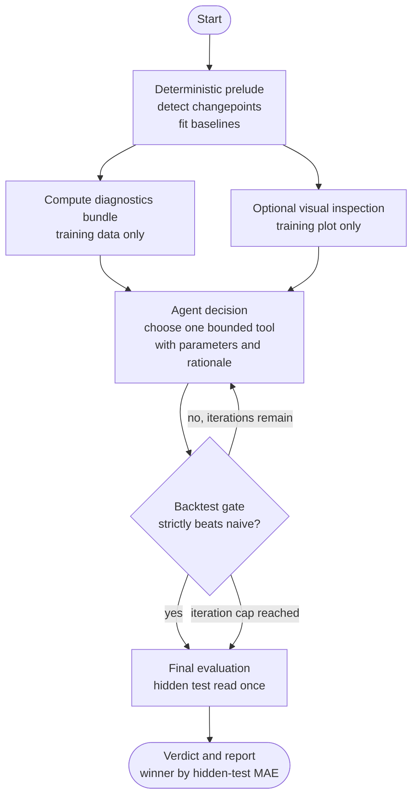

# Agent Loop

The agent follows a propose-then-prove loop. It may suggest repairs, but the deterministic gate is
the scorer.

## Inputs the agent can see

The agent may see:

- training-only series observations,
- deterministic diagnostics,
- visible scenario metadata,
- tool schemas,
- previous rejected signatures,
- accept/reject feedback from the gate.

The agent may not see:

- hidden test targets,
- audit-only injected boundaries,
- expected intervention families,
- numeric validation scores.

## Two model roles

The report describes two model roles:

| Role | Purpose |
| --- | --- |
| Visual model | Inspects a training-only plot and returns structured observations. |
| Decision model | Reads observations and numeric diagnostics, then chooses one tool. |

Both roles are bounded by the same tool registry and validation gate.

## Validation gate

The gate fits the proposed intervention on early training data and measures the validation tail. The
proposal is accepted only if it strictly beats the naive changepoint-window workflow. If it fails,
the signature is recorded and the agent is re-prompted.

The loop repeats for up to five iterations. If no candidate is accepted, the system still falls
back to a valid forecast path.

## Final verdict

The hidden test fold is read once, after the loop terminates. The final report compares:

1. full-history Prophet,
2. naive changepoint workflow,
3. accepted agent intervention.

The winner is selected by lowest hidden-test MAE. RMSE, WAPE, and sMAPE are also recorded.
