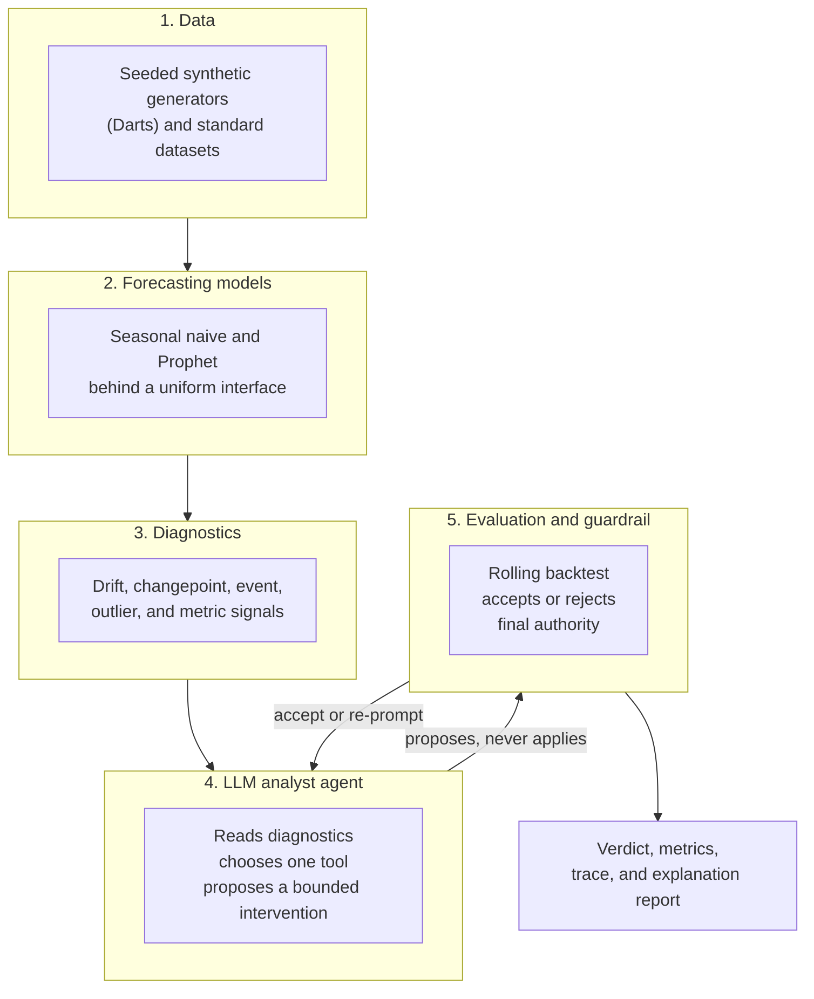

# Architecture

The repository separates a shared, review-gated core from thin pipelines. The core owns reusable
control flow; each pipeline supplies domain-specific data, diagnostics, prompts, and tools.

## Five layers

## Core versus pipelines

| Area | Responsibility |
| --- | --- |
| `src/ailf/core/agent/` | Graph engine, state, runtime, registry, and errors. |
| `src/ailf/core/backtest/` | Split handling and backtest gate. |
| `src/ailf/core/config/` | Config schema, loading, and resolution. |
| `src/ailf/core/events/` | Event stream powering live UI updates. |
| `src/ailf/core/metrics/` | Forecast metrics such as MAE, RMSE, WAPE, and sMAPE. |
| `src/ailf/core/models/` | LLM provider selection and model clients. |
| `src/ailf/core/reporting/` | Run directories and artifacts. |
| `src/ailf/pipelines/` | Thin use-case implementations. |
| `src/ailf/ui/` | Streamlit interface for the changepoint pipeline. |

The core is deviation-agnostic. It should not know whether a pipeline is handling changepoints,
drift, or anomalies.

## Serializable graph boundary

The agent graph state stays serializable. Model handles, framework objects, and other nonportable
runtime values are kept out of the state boundary. This makes traces easier to inspect and keeps the
engine testable.

## Tool registry

The current registry is in-process because the agent is the only consumer. That keeps the system
simple: no server lifecycle, transport schema, or deployment surface is needed. The registry shape
is still compatible with a future MCP server if another consumer appears.

## Reporting and reproducibility

Every run writes:

- effective config,
- metrics,
- event stream,
- agent trace,
- forecast comparison,
- explanation report.

Synthetic generation is seeded, and the hidden test fold is evaluated once after the agent loop
terminates.
