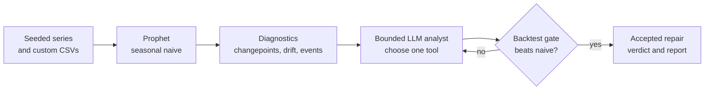

# Agent-in-the-Loop Forecasting

A bounded LLM agent acting as a junior forecasting analyst for Prophet.

The project keeps Prophet as the forecaster and automates the analyst role around it. The agent
diagnoses common failure modes such as drift, changepoints, and event contamination; proposes one
bounded intervention from a fixed menu; and accepts that intervention only when a deterministic
rolling backtest confirms an improvement.

!!! important "The agent does not forecast"
    Forecasting models forecast. Tools diagnose. The agent proposes a bounded repair. The
    backtest guardrail decides.

## Research question

Can a bounded LLM agent improve a forecasting pipeline by diagnosing common time-series failure
modes, recommending structural interventions, and validating those interventions through
backtesting?

## Why Prophet, not a bigger forecaster?

Prophet remains useful in large organizations because it is simple, fast, CPU-friendly, and
explainable. More powerful neural and foundation-model forecasters can be accurate, but they often
break the constraints that matter when a system must forecast millions of independent series:

- Scale: one customer or device fleet can produce thousands of independent series.
- Time: train and inference budgets are minutes, not hours.
- Cost: CPU-friendly forecasting is easier to operate than GPU-bound forecasting.
- Explainability: users still ask why a forecast moved.

The useful property of Prophet is that many failures can be repaired by changing interpretable
components: trend, seasonality, holidays, regressors, or fit windows. This project uses the LLM for
that analyst role rather than as a direct numerical forecaster.

## System at a glance



The shared core owns the agent graph, tool registry, backtest gate, metrics, event stream, config
resolution, and reporting. Thin pipelines supply data, diagnostics, prompts, and tools for each
failure family.

## Current result

The changepoint pipeline is the complete reference implementation. In a six-scenario stress suite,
the agent wins five scenarios and loses one:

| Pattern | Outcome | Main lesson |
| --- | --- | --- |
| Temporary events and sustained anomalies | Large wins | Cleaning reversible contamination beats treating it as a new regime. |
| Gradual drift | Useful win, not fully fixed | A single ramp repair helps but cannot express all future uncertainty. |
| Recurring event | Small win | The agent can be correct but not worth the latency and cost. |
| Permanent level shift | Loss | The agent confused a level shift with a ramp-like drift. |

The result is intentionally mixed: an analyst agent is valuable when it chooses a repair family that
the baseline workflow cannot express, but it is not a free accuracy upgrade.

## Quick start

Try the hosted Streamlit demo when it is available:

[Open ForeCast Explorer](https://agent-in-the-loop-forecasting.streamlit.app/)

Or run it locally:

```bash
uv sync
cp .env.example .env
uv run streamlit run src/ailf/ui/app.py
```

Run one scenario from the command line:

```bash
uv run python -m ailf.pipelines.changepoint.pipeline --scenario level_shift_loses_seasonality
```

The Streamlit app runs as a Python server, so GitHub Pages hosts only this documentation site.

## Documentation map

- [Getting Started](getting-started.md): install, configure, run the UI, and run scenarios.
- [Concepts](concepts.md): the analyst-in-the-loop framing and bounded intervention model.
- [Architecture](architecture.md): the shared core, thin pipelines, and module map.
- [Agent Loop](agent-loop.md): the propose-then-prove control flow.
- [Experiments](experiments/overview.md): scenario suite, evaluation protocol, and results.
- [Development](development/setup.md): working on the repo and adding new pipelines.

Built at IISc. The implementation is spec-driven, deterministic logic is test-first, agent behavior
is evaluated against hidden-test scenarios, and every accepted intervention must pass a backtest
gate.
