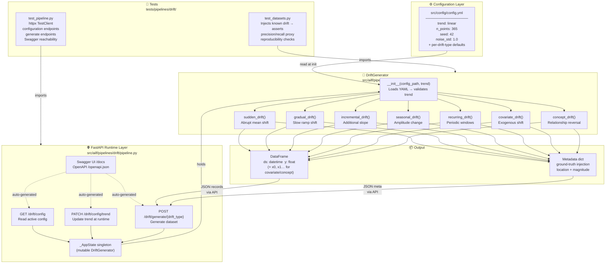
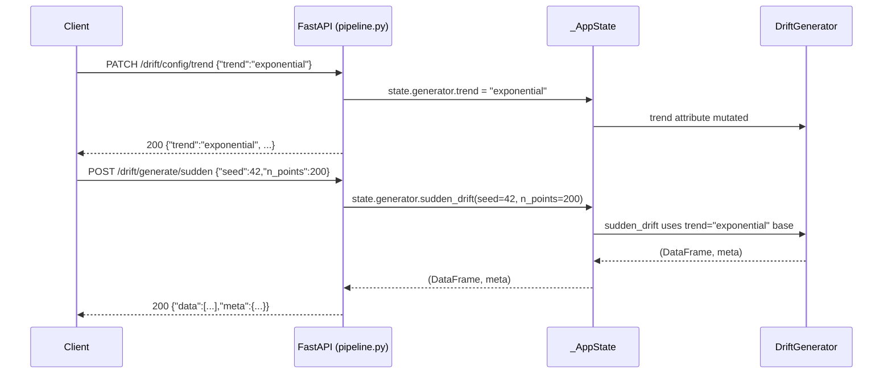

# Architecture — Phase 1: Drift Synthetic Dataset Generator

## System Flow Diagram

## Component Responsibilities

| Component | Responsibility |
|-----------|---------------|
| `src/config/config.yml` | Single source of defaults; `trend` is the primary runtime knob |
| `DriftGenerator` | Pure, typed, seeded generator; returns `(DataFrame, metadata)` |
| `pipeline.py` (FastAPI) | Thin HTTP layer over `DriftGenerator`; exposes Swagger UI |
| `_AppState` | Singleton that holds the mutable generator so PATCH effects persist |
| `test_datasets.py` | TDD tests against injected ground truth (Principle II) |
| `test_pipeline.py` | TestClient tests for all HTTP endpoints |

## Drift Types Quick Reference

| Method | What changes | Key parameter |
|--------|-------------|---------------|
| `sudden_drift` | Abrupt mean shift | `drift_point`, `magnitude` |
| `gradual_drift` | Slow linear ramp | `drift_start`, `drift_end`, `magnitude` |
| `incremental_drift` | Growing trend slope | `drift_start`, `slope` |
| `seasonal_drift` | Seasonal amplitude | `change_point`, `amplitude_before/after` |
| `recurring_drift` | Periodic drift windows | `period`, `duration`, `magnitude` |
| `covariate_drift` | Exogenous variable distribution | `drift_point`, `covariate_magnitude` |
| `concept_drift` | Feature→target relationship | `change_point`, `coef_before/after` |

## Runtime Trend Update Flow

